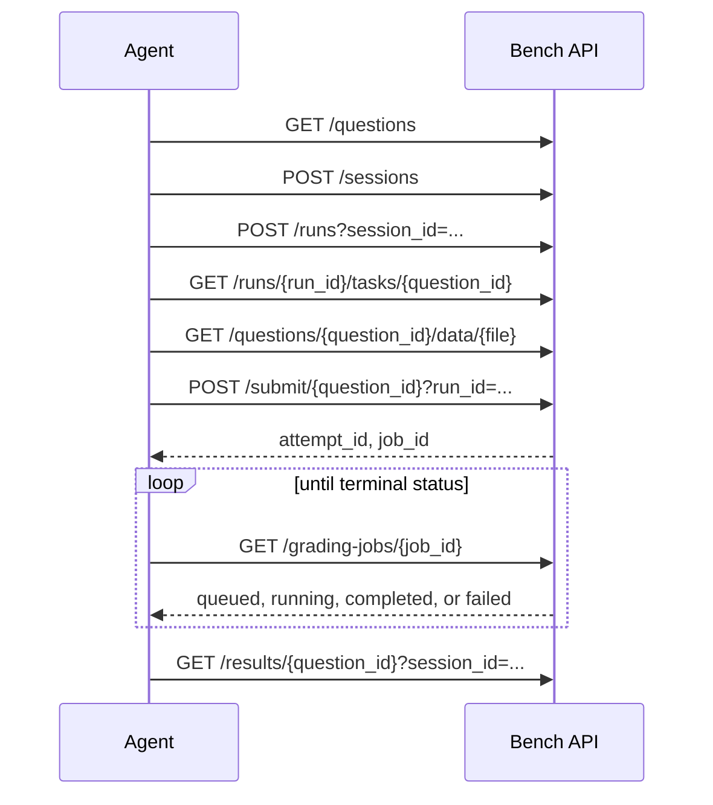

# MAT-AGENT-BENCH API

MAT-AGENT-BENCH exposes a question catalog and an asynchronous grading service for external agent systems. An agent chooses questions, activates them in an evaluation run, executes work in its own environment, uploads evidence and artifacts, then retrieves grading status and results.

## API base URL

When started with `./scripts/start_server.sh`, the combined UI and API use:

```text
http://127.0.0.1:8080/bench
```

Set the base URL once:

```bash
export API="http://127.0.0.1:8080/bench"
```

The interactive OpenAPI schema is at `$API/docs`.

## SSE status

The server does **not** currently expose Server-Sent Events (SSE). There are no `text/event-stream` or event-subscription endpoints.

Grading is asynchronous and uses durable polling instead:

```text
GET /grading-jobs/{job_id}
```

Poll until the job status is `completed` or `failed`. This is the supported integration contract; do not assume a WebSocket or SSE stream exists.

## Recommended workflow



See [HTTP API](api.md) for request and response details.

## Authentication

Question discovery and data downloads are public for the currently hosted catalog. Sessions, runs, submissions, attempts, jobs, and results require a token:

```http
X-API-Token: <token>
```

Tokens are issued through the benchmark UI. The API does not provide public token self-registration.

## Build locally

```bash
source .venv/bin/activate
pip install -e ".[docs]"
mkdocs serve
```

Open the local documentation site at `http://127.0.0.1:8000`.

GitHub Actions publishes the site from the default branch when GitHub Pages is configured to use Actions as its source.